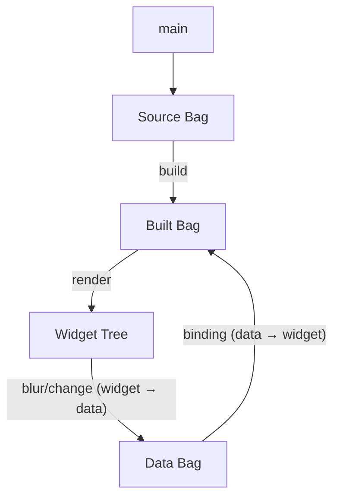

# Architecture

## Puppeteer and Puppet

genro-textual follows a strict separation between configuration and execution:

- **TextualApp** (puppeteer) — extends `BuilderManager`. Owns main, data, builder, build, binding. Creates and drives the LiveApp.
- **LiveApp** (puppet) — extends `textual.app.App`. No logic of its own. Built and controlled by the puppeteer.
- **Built Bag** — the script. Produced by the build step, kept in sync by BindingManager.

## Pipeline



### Single-Pass Build

The build step walks the source Bag once. For each node:
1. Clean subscription map for this subtree
2. Expand component if resolver present
3. Create node in Built Bag
4. Resolve `^pointers` against data and register in subscription map
5. Recurse into children

### Subscription Map

Flat `str → list[str]`:

```python
{
    "form.name": ["horizontal_0.verticalscroll_0.input_0?value",
                   "horizontal_0.verticalscroll_0.static_2"],
}
```

Key: data path. Value: built node paths (with optional `?attr` suffix).

## Modules

### textual_builder.py

`TextualWidgetsMixin` + `TextualBuilder(TextualWidgetsMixin, BagBuilderBase)`

All `@element` and `@component` definitions live in the mixin for inheritance via MRO.

Elements include:
- **Containers**: vertical, horizontal, grid, center, etc.
- **Widgets**: static, button, input, checkbox, datatable, tree (with store), etc.
- **App config**: css, binding (not rendered as widgets)
- **Components**: fieldset, form (expanded at build time)

### textual_compiler.py

`TextualCompiler(BagCompilerBase)`

Inherits `build()` from base (single-pass: expand + resolve + register).
Defines its own `_do_render(built_bag, live_app)`:

1. Extract `css` nodes → apply to `live_app.stylesheet`
2. Extract `binding` nodes → call `live_app.bind()`
3. Render remaining nodes as Textual widgets via `_render_node()`

**Dispatch**: `_render_<tag>` methods for special widgets (tabbedcontent, datatable, static, tree), `_render_default` for generic widgets via _meta (module + class).

**Attribute classification at mount**: for each node attribute:
1. Constructor parameter → `widget.__init__`
2. CSS property → `widget.styles`
3. Reactive attribute → `widget.set_reactive`

**Store binding**: when a widget has a `store` attribute (a Bag), `_mount` subscribes to the Bag for reactive updates. The Tree widget repopulates from the Bag on changes, preserving expanded state.

### textual_app.py

`TextualApp(BuilderManager)` — the puppeteer.

- `source` property exposes source Bag (domain name for Textual)
- `main(source)` — user override
- `_do_render()` — mounts widgets via `compiler._do_render()`
- `_on_node_updated(node)` — reactive: updates specific widget. Uses `call_from_thread` only when called from a different thread (remote REPL, timer).
- `_on_widget_changed(widget, value)` — bidirectional: widget → data
- `_find_compiled_path(node)` — uses `Bag.relative_path()` to find the node path in the Built Bag
- `_find_data_path(compiled_path)` — reverse-lookup in subscription map
- `run()` — creates LiveApp and starts Textual event loop

`LiveApp(App)` — the puppet.

- `compose()` → root Vertical container
- `on_mount()` → `owner.setup()` (store + main + build + subscribe + render)
- Events delegated to owner: button_pressed, key, descendant_blur, input_changed, checkbox_changed, switch_changed

## Data Binding

### Data to Widget (`^pointer`)

```python
source.static("^greeting")              # value bound to data["greeting"]
source.input(value="^form.name")        # attr bound to data["form.name"]
source.vertical(width="^_system.w")     # CSS property bound to data path
```

Flow: `data["greeting"] = "Hello"` → BindingManager → node updated → `_on_node_updated` → widget updated.

### Widget to Data (bidirectional)

- **Input**: writes on **blur** (via `on_descendant_blur`), not every keystroke
- **Checkbox/Switch**: writes on **change** (immediate)

Flow: user edits Input → Tab → `on_descendant_blur` → `_on_widget_changed` → `data.set_item(path, value, _reason=compiled_path)` → BindingManager notifies all subscribers except the originator.

### Anti-Loop via `_reason`

When a widget writes to data, it passes its compiled path as `_reason`. The BindingManager skips updating the node whose path matches the reason. Other widgets bound to the same data path update normally.

## Store (Bag-driven Widgets)

The `store` attribute on a widget receives a Bag object. At mount time:

1. The Bag reference is saved on the widget (`widget._store`)
2. A subscription is registered on the Bag
3. When the Bag changes, the widget repopulates (e.g., Tree clears and rebuilds, preserving expanded state)

```python
source.tree(label="data", store=self.data)
```

## System Data

Use `_system` prefix for infrastructure data (drawer state, inspector config) to separate from application data:

```python
self.data["_system.drawer.width"] = 40
self.data["_system.drawer.display"] = "block"
```

## Extending the Builder

Use mixins to add custom elements:

```python
class MyMixin:
    @component(sub_tags="")
    def login_form(self, comp, **kwargs):
        comp.input(placeholder="Username")
        comp.button("Login")

class MyBuilder(MyMixin, TextualBuilder):
    pass

class MyApp(TextualApp):
    builder_class = MyBuilder
```

The mixin pattern works because `_pop_decorated_methods` collects decorators from non-BagBuilderBase bases in the MRO.
