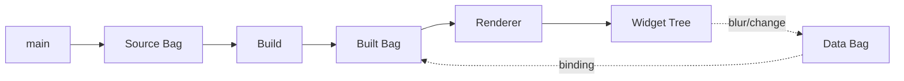

# Genro Textual

[](https://github.com/genropy/genro-textual)

A **declarative TUI framework** that builds terminal interfaces from [Bag](https://genro-bag.readthedocs.io) structures using [Textual](https://textual.textualize.io) as the rendering engine.

## The Idea

Instead of writing imperative widget code, you describe your UI in a **main method** — a series of builder calls that create a Bag structure. The framework builds this structure and renders it as a Textual application.

```python
from genro_textual import TextualApp

class MyApp(TextualApp):
    def main(self, source):
        source.binding(key="q", action="quit", description="Quit")
        source.static("^greeting")
        source.input(value="^form.name", placeholder="Your name")

    def store(self, data):
        data["greeting"] = "Hello, World!"
        data["form.name"] = ""

if __name__ == "__main__":
    MyApp().run()
```

## Key Concepts

- **main()** — Declare your UI structure with builder calls
- **Bag-driven** — All state lives in Bag structures (data, source, built)
- **Reactive binding** — `^pointer` syntax binds widgets to data paths
- **Bidirectional** — Input widgets write back to data on blur
- **CSS in main** — Inline stylesheets via `source.css()`
- **Puppeteer/Puppet** — TextualApp (logic) drives LiveApp (rendering)

## Architecture



---

**Next:** [Getting Started](getting-started.md) — Build your first app in 5 minutes

```{toctree}
:maxdepth: 1
:caption: Start Here
:hidden:

getting-started
```

```{toctree}
:maxdepth: 2
:caption: Guide
:hidden:

guide/building-ui
guide/data-binding
guide/css-and-styles
guide/widgets
guide/inspector
guide/cli
```

```{toctree}
:maxdepth: 2
:caption: Architecture
:hidden:

architecture
```

```{toctree}
:maxdepth: 1
:caption: Reference
:hidden:

reference/api
reference/widgets
```
